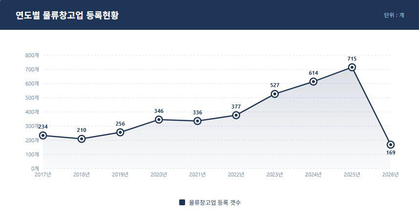
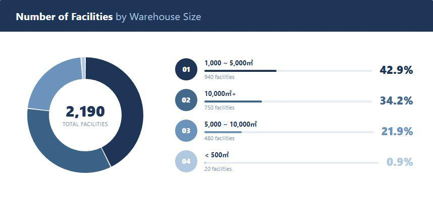
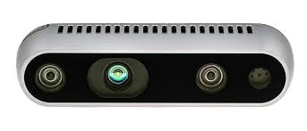
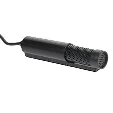
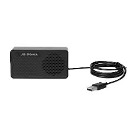
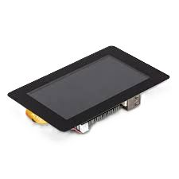
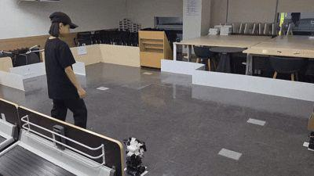
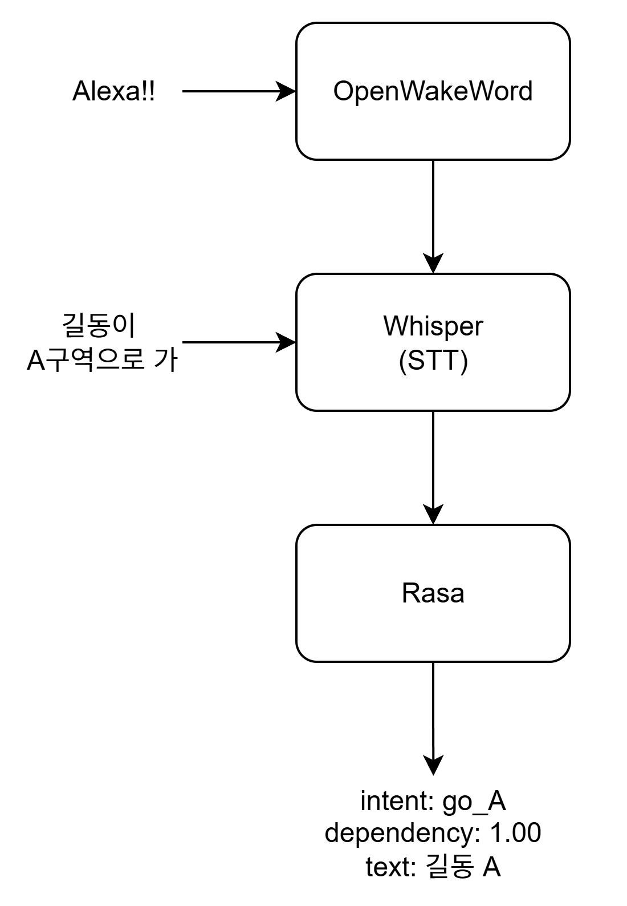

# 🤖 Vocal-Maestro Robot System (음성 명령 다중로봇 제어 시스템)

---

## 1. 개발 배경
물류 창고의 규모가 대형화(1,000~5,000㎡ 42.9%, 10,000㎡ 이상 34.2%)됨에 따라 작업자의 이동 거리가 길어지고 있습니다.

  
  

* 작업자의 이동을 최소화하여 피로도 및 부상 위험을 감소시키고 생산성을 향상시키기 위해 본 시스템을 기획했습니다.
* 비정형 창고 및 공장 등 유연한 환경 대응이 가능하며 인프라 변경 없이 도입 즉시 사용할 수 있는 다중 로봇 시스템이 필요합니다.

---

## 2. 프로젝트 개요
**Vocal-Maestro Robot System**은 음성 명령을 통해 다수의 로봇(Swarm System)을 제어하고 작업자를 추종하며 실시간 상태를 모니터링하는 솔루션입니다.

* **Voice Recognition:** 음성 명령을 통한 로봇 호출, 정지, 지정 구역 이동 제어를 지원합니다.
* **Follow People:** 작업자 객체를 인식하고 원활하게 추종합니다.
* **Swarm System:** 다중 로봇 환경에서의 원활한 통신 및 그룹 제어를 수행합니다.
* **Status & Database Display:** 로봇 상태 및 데이터베이스 로그를 실시간 대시보드로 표출합니다.

### 🛠️ Hardware 구성
4대의 Turtlebot3 Burger(알렉사, 철수, 길동, 영희) 및 다음의 장비들로 구성됩니다.

  
  
  
  

---

## 3. 시연 영상

*(위 썸네일을 클릭하면 유튜브 영상으로 이동합니다.)*

  

---

## 4. 기술 스택 및 아키텍처
* **Voice Recognition:** OpenWakeWord, Whisper, Rasa, Typecast TTS
* **Follow People:** Yolov5nu
* **Swarm System:** Domain Bridge, Nav2, Cartographer
* **Display & Database:** MariaDB, Qt5

---

## 5. 데이터베이스(DB) 설계

시스템의 원활한 모니터링과 이력 관리를 위해 MariaDB를 활용하여 로그와 상태 데이터를 체계적으로 수집합니다.

  

| 테이블명 | 핵심 역할 | 주요 컬럼 (Key Columns) |
| :--- | :--- | :--- |
| **`robot`** | 터틀봇 기본 정보 관리 | `robot_name`, `robot_type`, `ip_address` |
| **`robot_status_log`** | 터틀봇 실시간 텔레메트리 (위치/배터리 등) | `status`, `pos_x`, `pos_y`, `battery_pct` |
| **`voice_command_log`** | 사용자 음성 명령 이력 및 분석 결과 | `parsed_action`, `parsed_target`, `success` |
| **`robot_action_log`** | 로봇의 실제 이동 및 작업 수행 기록 | `action_type`, `location_from`, `location_to`, `result` |
| **`picking_event`** | 창고 내 피킹/적재 이벤트 관리 | `assigned_robot_id`, `location_code`, `event_type` |
| **`alert_log`** | 시스템 이상, 배터리 부족 등 경고 알림 | `severity`, `alert_type`, `message`, `resolved` |

---

## 6. 대시보드 상세
* **실시간 맵:** Qt5 기반으로 실제 맵 이미지(.pgm) 위에 4대의 로봇 위치를 실시간으로 매핑합니다.
* **사이드 패널:** 로봇 별 배터리 잔량, 현재 좌표, 작업 가능 상태 및 음성 인식 상태를 직관적으로 표시합니다.
* **배터리 경고:** 배터리가 20% 미만으로 떨어질 경우 경고 알림(Alert)을 띄우고 DB의 `alert_log`에 기록합니다.
* **데이터베이스 현황:** MariaDB와 연동하여 경고 이력, 동작 기록, 음성 명령 이력을 저장하고 대시보드에 모니터링 현황을 제공합니다.

---

## 7. 객체추종 상세
마스터 로봇에 부착된 Intel RealSense D435 카메라를 활용하여 작업자를 추종합니다.

  
  

* Yolov5nu 모델을 통해 탐지된 객체의 이미지상 중심 좌표를 정확히 추출합니다.
* 추출된 객체 좌표가 화면 중심에 오도록 로봇을 회전시키고, 해당 좌표의 Depth(깊이) 값을 계산하여 사람을 따라가도록 구동합니다.

---

## 8. 도메인브릿지 (Domain Bridge) 상세
다수의 로봇이 동일 네트워크 내에서 통신할 때 발생하는 노드/서비스 이름 충돌을 방지하기 위해 도메인을 분리했습니다.

* **메인 도메인:** 24 (대시보드 및 메인 노드용).
* **로봇 도메인:** 25(알렉사), 26(철수), 27(길동), 28(영희).
* **선별적 통신:** Domain Bridge를 통해 각 로봇의 필수 정보(battery_state, amcl_pose, status 등)만 24번 도메인으로 브릿징하여 간섭을 줄였습니다.
* **Action 통신 분리:** Nav2 Send Goal과 같은 통신은 브릿지 오버헤드를 고려하여 별도 프로세스로 관리합니다.

---

## 9. 음성인식 상세

  

* **WakeWord 감지:** OpenWakeWord를 사용하여 "Alexa!!" 호출을 인식합니다.
* **STT 변환:** 호출 후 입력된 음성을 Whisper 모델이 텍스트로 변환합니다.
* **의도 분석 (Intent Classification):** 변환된 텍스트를 Rasa 모델로 전송하여 사용자 의도(intent)와 대상 로봇 이름(entity: robot_name)을 추출합니다.
* **명령 하달:** Qt 기반의 디스플레이 노드에서 파싱된 VoiceResult 구조체 데이터를 수신하여 해당 로봇 제어 토픽으로 전송합니다. 이를 `voice_command_log`에 함께 기록하여 통계 데이터로 활용합니다.

---

## 10. 트러블 슈팅
* **Q. Qt 맵 상 위치 오차:** * **A.** ROS2 좌표계와 Qt 맵 픽셀 좌표계 사이의 스케일 및 오프셋 값 불일치로 오차가 발생했습니다. 로봇을 특정 위치에 고정시킨 뒤 수치를 반복 비교하여 오차를 줄인 근사 값으로 변환 처리했습니다.
* **Q. 지도상 작업자 위치 튐 현상:** * **A.** 마스터 로봇 회전 시 상대좌표계를 사용하여 객체 좌표가 함께 흔들리는 문제가 발생했습니다. 카메라 Depth 값을 절대 좌표계 기반으로 변환하는 로직으로 개선 방향을 도출했습니다.
* **Q. 임베디드 기기 병목 현상:** * **A.** 고해상도 이미지와 깊이 데이터 동시 처리로 라즈베리 파이의 CPU/네트워크 대역폭이 초과되었습니다. 전체 데이터를 구독하지 않고 객체 중심 좌표의 Depth 정보만 선택 추출하여 연산량을 대폭 낮췄습니다.
* **Q. 온디바이스 TTS 지연 및 인식률 저하:** * **A.** 임베디드 환경의 추론 지연과 Whisper Tiny 모델의 고유 명사 인식률 저하가 발생했습니다. 정적인 답변은 사전 생성된 오디오 파일(WAV/MP3) 재생으로 대체하여 지연을 제거했습니다.

---

## 11. 보완점 및 향후 과제
* **좌표계 변환 정밀도 향상:** 마스터 로봇 방향 변화에 따른 작업자 위치 표시 오류를 완전히 해결하기 위해, 카메라 데이터를 절대 좌표계 기반으로 정교하게 변환하는 로직의 구현이 필요합니다.
* **오프로딩(Offloading) 구조 도입:** 음성 처리 연산 부하를 임베디드 기기에서 분산시키기 위해, 음성 데이터를 외부 고성능 PC로 전송하여 처리하는 아키텍처 도입을 고려하고 있습니다.
* **하드웨어 보강:** 작은 모델(Whisper Tiny) 특성상 발생하는 '터틀봇' 등 고유 명사 인식률 저하 문제를 극복하기 위해, 음성 인식 전용 보드의 추가 장착을 검토 중입니다.
* **안정화 및 심화 테스트:** 제한된 프로젝트 기간으로 인해 부족했던 실환경 기반의 테스트를 추가로 수행하여, 세세한 엣지 케이스와 버그를 수정해 나갈 예정입니다.